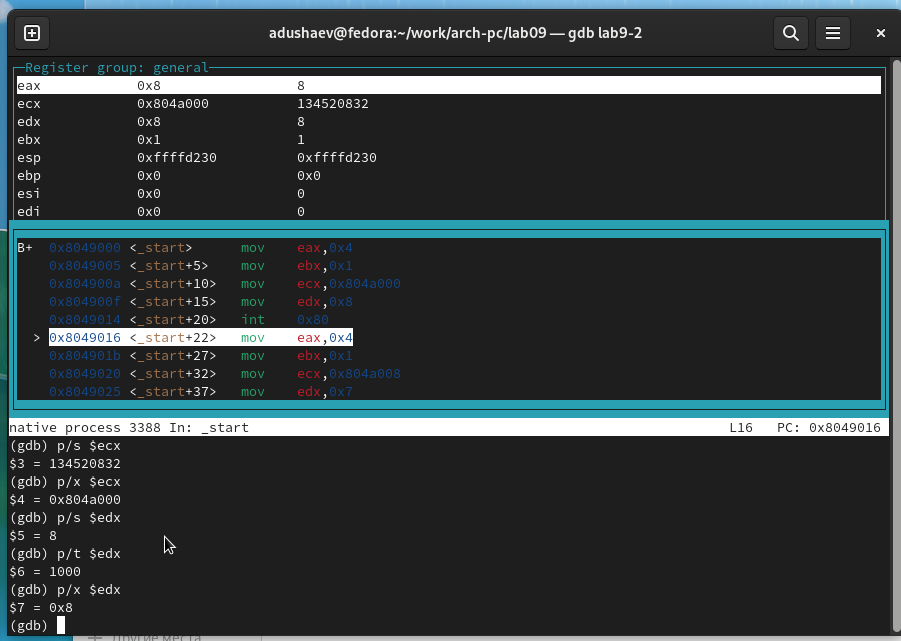

---
## Front matter
title: "Отчёт по лабораторной работе 9"
subtitle: "Архитектура компьютера"
author: "Душаев Азимбек Юсуфович НКАбд-02-23"

## Generic otions
lang: ru-RU
toc-title: "Содержание"

## Bibliography
bibliography: bib/cite.bib
csl: pandoc/csl/gost-r-7-0-5-2008-numeric.csl

## Pdf output format
toc: true # Table of contents
toc-depth: 2
lof: true # List of figures
lot: true # List of tables
fontsize: 12pt
linestretch: 1.5
papersize: a4
documentclass: scrreprt
## I18n polyglossia
polyglossia-lang:
  name: russian
  options:
	- spelling=modern
	- babelshorthands=true
polyglossia-otherlangs:
  name: english
## I18n babel
babel-lang: russian
babel-otherlangs: english
## Fonts
mainfont: PT Serif
romanfont: PT Serif
sansfont: PT Sans
monofont: PT Mono
mainfontoptions: Ligatures=TeX
romanfontoptions: Ligatures=TeX
sansfontoptions: Ligatures=TeX,Scale=MatchLowercase
monofontoptions: Scale=MatchLowercase,Scale=0.9
## Biblatex
biblatex: true
biblio-style: "gost-numeric"
biblatexoptions:
  - parentracker=true
  - backend=biber
  - hyperref=auto
  - language=auto
  - autolang=other*
  - citestyle=gost-numeric
## Pandoc-crossref LaTeX customization
figureTitle: "Рис."
tableTitle: "Таблица"
listingTitle: "Листинг"
lofTitle: "Список иллюстраций"
lotTitle: "Список таблиц"
lolTitle: "Листинги"
## Misc options
indent: true
header-includes:
  - \usepackage{indentfirst}
  - \usepackage{float} # keep figures where there are in the text
  - \floatplacement{figure}{H} # keep figures where there are in the text
---

# Цель работы

Целью работы является приобретение навыков написания программ с использованием подпрограмм.
Знакомство с методами отладки при помощи GDB и его основными возможностями.

# Выполнение лабораторной работы

1. Создал каталог для выполнения лабораторной работы № 9 и перешел в него. 
Затем создал файл lab9-1.asm.

2.  В качестве примера рассмотрим программу, которая вычисляет 
арифметическое выражение $f(x) = 2x+7$ с помощью подпрограммы calcul. 
В данном примере значение $x$ вводится с клавиатуры, а само выражение 
вычисляется внутри подпрограммы.

{ #fig:001 width=70%, height=70% }

{ #fig:002 width=70%, height=70% }

3. Внесены изменения в текст программы, добавлена подпрограмма subcalcul 
внутри подпрограммы calcul для вычисления выражения $f(g(x))$, где значение 
$x$ также вводится с клавиатуры, а функции $f(x) = 2x + 7$ и $g(x) = 3x − 1$ 
вычисляются внутри подпрограмм.

{ #fig:003 width=70%, height=70% }

{ #fig:004 width=70%, height=70% }

4. Создан файл lab9-2.asm с текстом программы из Листинга 9.2, который представляет программу печати сообщения "Hello world!".

{ #fig:005 width=70%, height=70% }

Был получен исполняемый файл. Для возможности работы с отладчиком GDB необходимо
 добавить отладочную информацию в исполняемый файл, для этого трансляция 
 программы должна быть выполнена с использованием ключа "-g".

Загрузка исполняемого файла в отладчик GDB была выполнена успешно. 
Для проверки работоспособности программы была использована команда run 
(сокращенно r) в оболочке GDB.

{ #fig:006 width=70%, height=70% }

Для более детального анализа программы, установите точку остановки на метке "start", с которой начинается выполнение любой ассемблерной программы, и запустите программу. Затем просмотрите дизассемблированный код программы.

{ #fig:007 width=70%, height=70% }

{ #fig:008 width=70%, height=70% }

На предыдущих шагах была установлена точка остановки на метке "_start". 
Чтобы проверить это, воспользуйтесь командой "info breakpoints" 
(сокращенно "i b"). Добавьте еще одну точку остановки на адресе инструкции.
 Адрес инструкции можно увидеть в средней части экрана в левом столбце 
 соответствующей инструкции. Определите адрес предпоследней инструкции 
 "mov ebx, 0x0" и установите точку остановки.

{ #fig:009 width=70%, height=70% }

Отладчик может отображать содержимое ячеек памяти и регистров, а также позволяет вручную изменять значения регистров и переменных. Выполните 5 инструкций с помощью команды 
"stepi" (или "si") и проследите за изменением значений регистров.

{ #fig:010 width=70%, height=70% }

{ #fig:011 width=70%, height=70% }

Просмотрите значение переменной "msg1" по имени и значение переменной "msg2" по адресу.

Чтобы изменить значение регистра или ячейки памяти, воспользуйтесь командой 
"set", указав имя регистра или адрес в качестве аргумента. 
Измените первый символ переменной "msg1".

{ #fig:012 width=70%, height=70% }

Выведите значение регистра "edx" в различных форматах (шестнадцатеричном, двоичном и символьном).

{ #fig:013 width=70%, height=70% }

Используя команду "set", измените значение регистра "ebx".

{ #fig:014 width=70%, height=70% }

5.  Скопировал файл lab8-2.asm, созданный в процессе выполнения лабораторной 
работы №8, который содержит программу для вывода аргументов командной строки. 
Затем создал исполняемый файл. Для загрузки программы с аргументами в отладчик 
GDB необходимо использовать ключ "--args". Загрузил исполняемый файл в отладчик, 
указав аргументы командной строки.

Для начала установил точку останова перед первой инструкцией в программе и запустил ее.

Адрес вершины стека, который хранится в регистре ESP, указывает на число 
аргументов командной строки (включая имя программы), которое находится по 
этому адресу. В данном случае число аргументов равно 5, включая имя программы 
"lab9-3" и сами аргументы: "аргумент1", "аргумент2" и "аргумент3".

Далее были просмотрены остальные позиции в стеке. По адресу [ESP+4] находится 
адрес в памяти, где располагается имя программы, по адресу [ESP+8] 
хранится адрес первого аргумента, по адресу [ESP+12] – второго аргумента 
и так далее.

{ #fig:015 width=70%, height=70% }

Шаг изменения адреса равен 4, так как каждая следующая позиция в стеке смещается на размер переменной, который составляет 4 байта.

6. Внес изменения в программу из лабораторной работы №8 (Задание №1 для самостоятельной работы), чтобы реализовать вычисление значения функции f(x) в виде подпрограммы.

{ #fig:016 width=70%, height=70% }

{ #fig:017 width=70%, height=70% }

7. Приведенный ниже листинг содержит программу для вычисления выражения 
$(3+2)*4+5$. 
После запуска данная программа дает неверный результат. 
Проверил это с помощью отладчика GDB и анализа изменений значений регистров. 
Определил ошибку и внес соответствующие исправления

{ #fig:018 width=70%, height=70% }

{ #fig:019 width=70%, height=70% }

Отмечу, что в исходной программе был перепутан порядок аргументов у инструкции add, а также в конце работы значение ebx передается в edi вместо eax.

Исправленный код программы

{ #fig:020 width=70%, height=70% }

{ #fig:021 width=70%, height=70% }

# Выводы

Освоили работy с подпрограммами и отладчиком.